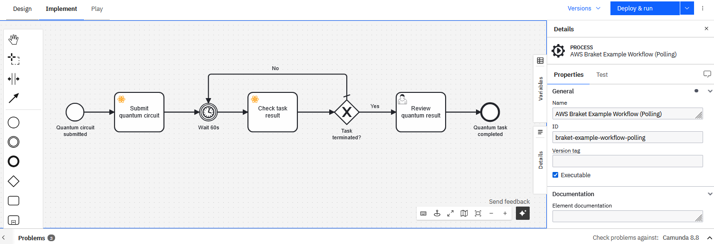

# AWS Braket Connector for Camunda 8

*Run quantum circuits from your BPMN workflow — on real quantum computers available via AWS Braket 🚀*

[](https://github.com/envite-consulting/aws-braket-connector-camunda-8/actions/workflows/build.yml)
[](https://docs.camunda.io/)
[](https://marketplace.camunda.com/en-US/listing?q=aws%20braket&page=1)
[](https://envite.de/)
[](/LICENSE)

The **AWS Braket Connector** is a [Camunda 8 outbound connector](https://docs.camunda.io/docs/components/connectors/introduction-to-connectors/) that integrates quantum computing into BPMN workflows by submitting and polling jobs on [AWS Braket](https://aws.amazon.com/braket/) backends.
It accepts quantum circuits as OpenQASM strings or raw JSON parameters, and offers blocking and non-blocking (polling) execution patterns to handle the unpredictable queue times of real quantum hardware.
For higher-level algorithms — such as Grover's search algorithm or Quantum Approximate Optimization Algorithm (QAOA) — the [AWS Braket Algorithm Accelerator pattern](docs/use-predefined-algorithms.md) extends the connector with a lightweight Python sidecar
This sidecar generates circuits from classical problem inputs and interprets raw measurement results, enabling the execution of variational quantum algorithms with classical optimization loops within a BPMN workflow.

In addition to the exemplary workflows orchestrating complex quantum algorithms, two simpel example workflows are provided in the `example/getting-started/` directory:

- **[Blocking](example/getting-started/braket-example-workflow-blocking.bpmn)** — submits a circuit and blocks the connector thread until the job reaches a terminal state (`waitForResult=true`). This is simple to use, but quantum jobs on real hardware backends may queue for longer than the configured timeout, causing the connector to throw a timeout exception and Camunda to re-execute the circuit. Further, this can lead to an incidents if all retries are used.
- **[Polling](example/getting-started/braket-example-workflow-polling.bpmn)** — submits the job without waiting (`waitForResult=false`), then polls the result every 30 seconds via a BPMN timer loop using the `GET_JOB_RESULT` operation. Recommended for real hardware backends where execution time is unpredictable.

Both workflows include a start event with an input form for all relevant connector parameters, the AWS Braket Connector service task, a user task for reviewing the result, and an end event.
The polling example workflow can be seen below.
In the first step of the process, the quantum circuit is submitted using the AWS Braket Connector, afterward a loop is entered, checking for the current state of the quantum job every 30s using the connector until it reaches a terminated state (completed, canceled, error).
To run the example, follow the steps under [How to Run](#-how-to-run), and then import the file into Camunda Modeler.



---

# Table of Contents

* 🚀 [How to Run](#-how-to-run)
* 📚 [Connector Documentation](#-connector-documentation)
    * [Getting Started](docs/getting-started.md)
    * [Connector Configuration and Output Reference](docs/connector-reference.md)
    * [Using Predefined Quantum Algorithms via a Sidecar](docs/use-predefined-algorithms.md)
    * [Example Use Cases & HowTos](docs/usecases.md)
* 🛠️ [Development and Project Setup](#️-development-and-project-setup)

---

## 🚀 How to Run

### Prerequisites

- **Java 21**
- **Maven 3.8+** (only required when building from source)
- A running **Camunda 8** instance (SaaS or Self-Managed)
- An **AWS account** with an IAM user or role that has permission to call `braket:CreateQuantumTask`, `braket:GetQuantumTask`, and `s3:GetObject` on the result bucket

### 1. Configure the Connector

The connector reads its Camunda 8 connection details from environment variables.
Copy `.env.example` to `.env` and fill in your cluster credentials:

```dotenv
CAMUNDA_CLIENT_ID=<your-client-id>
CAMUNDA_CLIENT_SECRET=<your-client-secret>
CAMUNDA_CLUSTER_ID=<cluster-id>
CAMUNDA_REGION=<region>
```

AWS credentials are **not** configured here — they are supplied per task via the connector input fields (`accessKeyId`, `secretAccessKey`, and optionally `sessionToken`).
Use [Camunda Secrets](https://docs.camunda.io/docs/components/console/manage-clusters/manage-secrets/) to store them securely and reference them as `secrets.AWS_ACCESS_KEY_ID`, `secrets.AWS_SECRET_ACCESS_KEY`, etc.

By default, Camunda SaaS Connector secrets are enabled in the `application.properties` file.
When using environment variables instead toggle the following setting to `false`.

```properties
camunda.connector.secretprovider.console.enabled=true
```

### 2. Run the Connector

**Option A — Pre-built JAR (recommended)**

Download the latest `aws-braket-connector-camunda-8-*.jar` from the [GitHub Releases](https://github.com/envite-consulting/aws-braket-connector-camunda-8/releases) page and place it in a directory alongside your `.env` file and run the JAR:

```bash
# Linux / macOS
set -a && source .env && set +a
java -jar aws-braket-connector-camunda-8-*.jar
```

```powershell
# Windows PowerShell
Get-Content .env | ForEach-Object {
    if ($_ -match '^\s*([^#][^=]*)=(.*)$') {
        [System.Environment]::SetEnvironmentVariable($matches[1].Trim(), $matches[2].Trim())
    }
}
java -jar aws-braket-connector-camunda-8-*.jar
```

Alternatively, pass each variable explicitly on the command line:

```bash
CAMUNDA_CLIENT_ID=... \
CAMUNDA_CLIENT_SECRET=... \
CAMUNDA_CLUSTER_ID=... \
CAMUNDA_REGION=... \
java -jar aws-braket-connector-camunda-8-*.jar
```

> **Note:** The element template `braket-connector.json` is also available as a release artifact — download it instead of fetching it from the repository.

**Option B — Build from source**

```bash
mvn package
set -a && source .env && set +a
java -jar target/aws-braket-connector-camunda-8-*.jar
```

---

The connector registers itself as a Camunda job worker and starts polling for jobs of type `de.envite:aws-braket-connector:1`.

### 3. Import the Element Template

Import `element-templates/braket-connector.json` into your Camunda Modeler to get the pre-configured service task with all input fields and the AWS Braket icon:

- **Camunda Web Modeler**: go to your project → *Create new* → *Upload files* → select `element-templates/braket-connector.json`. Afterward, open the element template and publish it to the project or organization.
- **Camunda Desktop Modeler**: copy the file into the `resources/element-templates` directory of the modeler.

### 4. Model and Deploy a Process

Example workflows are provided in `example/getting-started/` (see [above](#aws-braket-connector-for-camunda-8) for a description of each).
The connector can automatically deploy both example workflows and their forms to your Camunda cluster on startup by enabling the following property in `application.properties`:

```properties
braket.example.deploy=true
```

> **Note:** Keep this set to `false` (the default) in production environments.

If you prefer to deploy manually, upload the desired workflow from `example/getting-started/` together with `example/getting-started/braket-input-form.form` and `example/getting-started/braket-result-form.form` to your cluster — either via Camunda Web Modeler or the Zeebe API.
In case you published the element template to a project, upload the workflow to the **same project** so Web Modeler automatically links the template and displays the connector with its icon.

To model your own process, add a service task and apply the **AWS Braket Connector** element template, then fill in the required properties.
The full configuration and output reference can be found [here](docs/connector-reference.md).

## 📚 Connector Documentation

* [Getting Started](docs/getting-started.md): Details of how to get started with the AWS Braket Connector
* [Connector Configuration and Output Reference](docs/connector-reference.md): All configuration properties and the connector output fields available for use in result expressions and downstream tasks
* [Using Predefined Quantum Algorithms via a Sidecar](docs/use-predefined-algorithms.md): Architecture and integration guide for using a AWS Braket sidecar to generate quantum circuits from classical problem inputs and post-process measurement results — including support for variational algorithms (VQE, QAOA) with classical optimizer loops.
* [Example Use Cases & HowTos](docs/usecases.md): End-to-end workflow examples including Grover's search algorithm

## 🛠️ Development and Project Setup

### Project Structure

```
src/main/java/de/envite/connector/braket/
├── BraketConnectorApplication.java   # Spring Boot entry point
├── BraketConnectorFunction.java      # Connector entry point — dispatches to BraketService
├── BraketService.java                # Core logic: submit task, poll result
├── BraketTaskClient.java             # AWS Braket REST API client
├── BraketS3Client.java               # S3 client for fetching task result objects
├── BraketAuthProvider.java           # AWS credentials provider (static keys / session token)
├── BraketParameterHandler.java       # Circuit input normalisation (OpenQASM / Direct Params)
├── BraketConstants.java              # Shared constants (API paths, endpoint patterns)
├── dto/                              # Request / response DTOs
├── model/                            # Model classes (OperationMode, CircuitInputMode)
└── deployment/                       # Auto-deploys example workflows on startup (optional)

element-templates/                    # Camunda element template (connector UI)
example/
├── getting-started/                  # Simple blocking and polling example workflows
└── predefined-algorithms/            # Grover and QAOA end-to-end examples with sidecar
docs/                                 # Extended documentation
```


### Build

```bash
mvn package
```

Produces a self-contained JAR in `target/`.

### Testing

Unit and service tests (no external dependencies):

```bash
mvn test
```

Workflow integration tests use [Testcontainers](https://testcontainers.com/) to spin up a real Camunda Engine in Docker and exercise the full connector path end-to-end:

```bash
mvn test -Dgroups=workflow
```

These are excluded from the default `mvn test` run and require a local Docker daemon.

### Linting

The project uses **Checkstyle** (Google Java Style) for code style analysis.

Run the check locally using:

```bash
mvn checkstyle:check
```

Both checks also run as a dedicated `lint` job in CI on every push and pull request.

### IDE Setup

**IntelliJ IDEA** has a Checkstyle plugin available via *Settings → Plugins → Marketplace*:

| Plugin | Marketplace name |
|---|---|
| Checkstyle | `CheckStyle-IDEA` |

**Checkstyle-IDEA configuration:**

1. Open *Settings → Tools → Checkstyle*.
2. Under *Configuration File*, click **+** and select **Use a local Checkstyle file** and select [checkstyle_configuration.xml](checkstyle_configuration.xml).
3. Set it as the active configuration.

Once active, violations appear as inline editor warnings and in the *Checkstyle* tool window.

The IntelliJ code formatter (`Ctrl+Alt+L`) can be aligned with the Code style by importing the scheme via *Settings → Editor → Code Style → Java → ⚙ → Import Scheme → IntelliJ IDEA code style XML* and selecting [checkstyle_configuration.xml](checkstyle_configuration.xml), so auto-formatting produces compliant output.


## 📨Contact

If you have any questions or ideas feel free to start a [discussion](https://github.com/envite-consulting/aws-braket-connector-camunda-8/discussions) or contact us via [mail](mailto:quantum-computing@envite.de).

This open source project is being developed by [envite consulting GmbH](https://envite.de).


